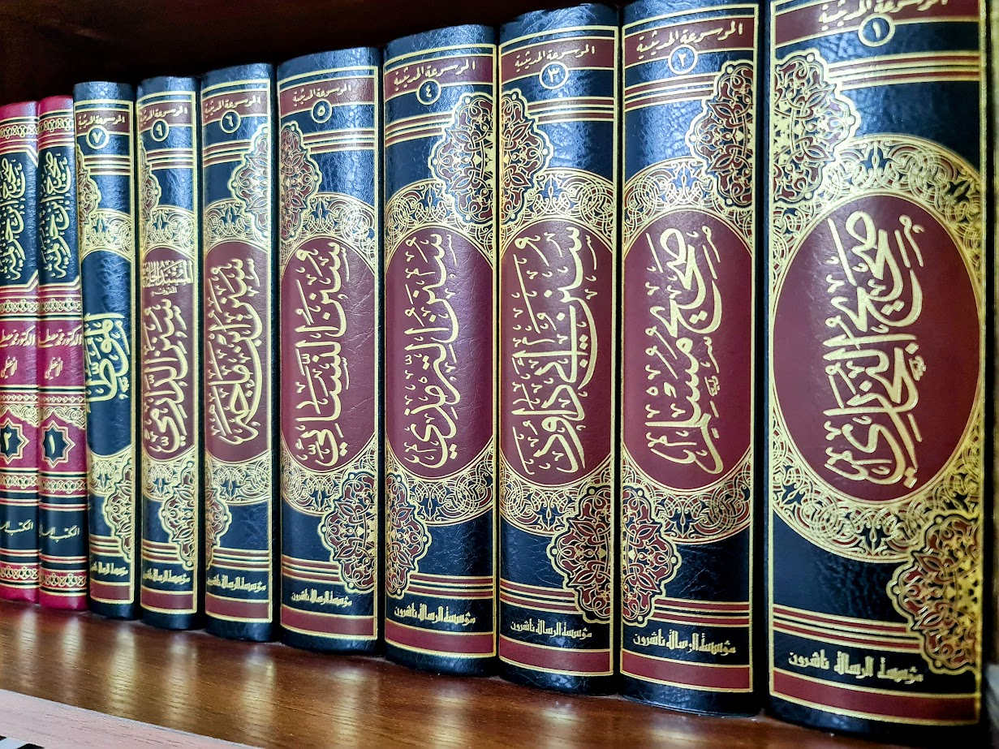

# Hadith-Project

**An open Hadith Library that contains full databases of 9 different books (including the Six Books), with the Elaboration of the 'Ahadith', all the following are included:**

- Sahih al-bukhari (صحيح البخاري).
- Sahih Muslim (صحيح مسلم).
- Sunan Abu-Dawud (سُنن ابي داود).
- Jami al-Tirmidhi (جامع الترمذي).
- Al-Sunan al-Sughra, collected by al-Nasa'i (السُنن الصغري).
- Sunan ibn Majah (سُنن بن ماجه).
- Muwatta Malik (موطأ الإمام مالك).
- Musnad Ahmad ibn Hanbal (مُسند الإمام أحمد بن حنبل).
- Sunan al-Darimi (سُنن الدارمي).

---

***Kutub al-Sittah*** ([Arabic](https://en.wikipedia.org/wiki/Arabic_language "Arabic language"): ٱلْكُتُب ٱلسِّتَّة, [romanized](https://en.wikipedia.org/wiki/Romanization_of_Arabic "Romanization of Arabic"): *al-Kutub al-Sitta*, [lit.](https://en.wikipedia.org/wiki/Literal_translation "Literal translation") 'the Six Books'), also known as ***al-Sihah al-Sitta*** ([Arabic](https://en.wikipedia.org/wiki/Arabic_language "Arabic language"): الصحاح الستة, [romanized](https://en.wikipedia.org/wiki/Romanization_of_Arabic "Romanization of Arabic"): *al-Ṣiḥāḥ al-Sitta*, [lit.](https://en.wikipedia.org/wiki/Literal_translation "Literal translation") 'the Authentic Six') are the six canonical [hadith](https://en.wikipedia.org/wiki/Hadith "Hadith") collections of [Sunni Islam](https://en.wikipedia.org/wiki/Sunni_Islam "Sunni Islam"). They were compiled in the 9th-century CE.

The books are the *[Sahih](https://en.wikipedia.org/wiki/Sahih_al-Bukhari "Sahih al-Bukhari")* of [al-Bukhari](https://en.wikipedia.org/wiki/Muhammad_al-Bukhari "Muhammad al-Bukhari") (d. 870), the *[Sahih](https://en.wikipedia.org/wiki/Sahih_Muslim "Sahih Muslim")* of [Muslim ibn al-Hajjaj](https://en.wikipedia.org/wiki/Muslim_ibn_al-Hajjaj "Muslim ibn al-Hajjaj") (d. 875), the *[Sunan](https://en.wikipedia.org/wiki/Sunan_Abi_Dawud "Sunan Abi Dawud")* of [Abu Dawud](https://en.wikipedia.org/wiki/Abu_Dawud_al-Sijistani "Abu Dawud al-Sijistani") (d. 889), the *[Sunan](https://en.wikipedia.org/wiki/Sunan_al-Tirmidhi "Sunan al-Tirmidhi")* of [al-Tirmidhi](https://en.wikipedia.org/wiki/Al-Tirmidhi "Al-Tirmidhi") (d. 892) and the *[Sunan](https://en.wikipedia.org/wiki/Al-Sunan_al-Sughra "Al-Sunan al-Sughra")* of [al-Nasa&#39;i](https://en.wikipedia.org/wiki/Al-Nasa%27i "Al-Nasa'i") (d. 915). The canonical version includes the *[Sunan](https://en.wikipedia.org/wiki/Sunan_ibn_Majah "Sunan ibn Majah")* of [Ibn Majah](https://en.wikipedia.org/wiki/Ibn_Majah "Ibn Majah") (d. 887 or 889) as the sixth book, though some instead listed the *[Muwatta](https://en.wikipedia.org/wiki/Muwatta_Imam_Malik "Muwatta Imam Malik")* of [Malik ibn Anas](https://en.wikipedia.org/wiki/Malik_ibn_Anas "Malik ibn Anas") (d. 795) or *[Sunan](https://en.wikipedia.org/wiki/Sunan_al-Daraqutni "Sunan al-Daraqutni")* of [al-Daraqutni](https://en.wikipedia.org/wiki/Al-Daraqutni "Al-Daraqutni") (d. 995).

They were first formally grouped and defined by [Ibn al-Qaisarani](https://en.wikipedia.org/wiki/Ibn_Tahir_of_Caesarea "Ibn Tahir of Caesarea") in the 11th century, who added [Sunan ibn Majah](https://en.wikipedia.org/wiki/Sunan_ibn_Majah "Sunan ibn Majah") to the list. The sixth book is disputed in Sunni Muslim jurisprudence; in particular, the [Malikis](https://en.wikipedia.org/wiki/Maliki "Maliki") and [Ibn al-Athir](https://en.wikipedia.org/wiki/Ibn_al-Athir "Ibn al-Athir") consider [al-Muwatta&#39;](https://en.wikipedia.org/wiki/Muwatta_Imam_Malik "Muwatta Imam Malik") to be the sixth book. Some scholars considered [Sunan al-Daraqutni](https://en.wikipedia.org/wiki/Sunan_al-Daraqutni "Sunan al-Daraqutni") to be the sixth book. The reason for the addition of Ibn Majah's Sunan is that it contains many Hadiths which do not figure in the other five, whereas all the Hadiths in the Muwatta' figure in the other Sahih books.

---

**Each folder contains 2 files:**

1. A (.csv) file of the 'Ahadith' and 'Tafseel' **with** Arabic diacritics (tashkeel تشكيل), and Elaboration of Hadith (Tafseel  تفصيل الحديث).
2. A (.csv) file of the 'Ahadith' only **without** Arabic diacritics.

> this structure will overcome Arabic Searching problems stated
> [here](http://safe.phpclasses.net/browse/view/html/file/12751/name/readme.html), so you can search user's input **without** diacritics, and return results **with** diacritics.

---

notes:

- the version with diacritcs include special RTL character that surrounds special words, such as important words or narrator's names. the original writers did that so developers could highlight these words, more information about how to implement this properly is in [this link](https://stackoverflow.com/a/45018642/3578585).
- if you feel uncomfortable with the RTL character, you can remove it, and you would still be able to highlight some important words, as they are surrounded by 2 spaces at the beginning and another 2 at the end.
- the vresion **without** diacritcs is completely clean, no RTL character, no double spaces.
- please don't use the version **without** diacritcs as your main database, alwayse show Hadith with diacritcs, so they can be read properly.
- the code used to remove the diacritics can be found [here](https://gist.github.com/mhashim6/7d96f7ea274c9eb7e509798a332d78ac).
- UTF-8 encoding is always used.
- both 'Musnad Ahmad ibn Hanbal' and 'Sunan al-Darimi' don't include elaboration.

---

**The original CSV files can be found in [hadith-islamware repository](https://github.com/ceefour/hadith-islamware).**
